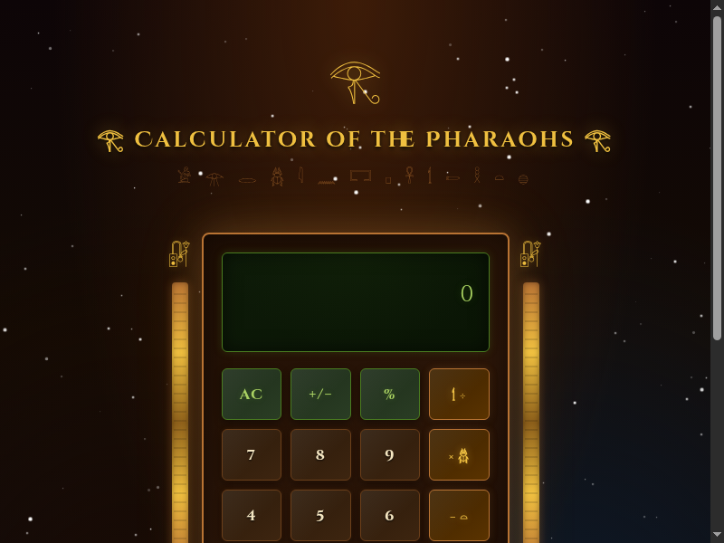

<div align="center">

```
𓂀 ─────────────────────────────────────────── 𓂀
   ██████╗ ██╗   ██╗██████╗ ████████╗██╗ █████╗ ███╗   ██╗
  ██╔════╝ ╚██╗ ██╔╝██╔══██╗╚══██╔══╝██║██╔══██╗████╗  ██║
  ██║  ███╗ ╚████╔╝ ██████╔╝   ██║   ██║███████║██╔██╗ ██║
  ██║   ██║  ╚██╔╝  ██╔═══╝    ██║   ██║██╔══██║██║╚██╗██║
  ╚██████╔╝   ██║   ██║        ██║   ██║██║  ██║██║ ╚████║
   ╚═════╝    ╚═╝   ╚═╝        ╚═╝   ╚═╝╚═╝  ╚═╝╚═╝  ╚═══╝
     C A L C U L A T O R   O F   T H E   P H A R A O H S
𓆣 ─────────────────────────────────────────── 𓆣
```

[](https://highviewone.github.io/EgyptianCalculator/)
[](LICENSE)
[](https://developer.mozilla.org/en-US/docs/Web/HTML)
[](https://developer.mozilla.org/en-US/docs/Web/CSS)
[](https://developer.mozilla.org/en-US/docs/Web/JavaScript)

*A fully functional calculator draped in the gold and mystery of ancient Egypt.*

<br />



</div>

---

## 𓇋 Features

| Feature | Description |
|---|---|
| 𓂀 **Egyptian Aesthetic** | Dark starfield sky, gold/bronze palette, temple pillars, Eye of Ra |
| 𓏏 **Hieroglyphic Numerals** | Results displayed in authentic ancient Egyptian number glyphs |
| 𓆣 **Full Calculator** | Addition, subtraction, multiplication, division, %, sign toggle, decimals |
| 𓋹 **Live Preview** | Answer appears as you type — no need to hit equals first |
| 𓌀 **Keyboard Support** | Numbers, operators, Enter, Backspace, Escape all work |
| 𓇋 **No Dependencies** | Pure HTML · CSS · JS — zero build steps, zero frameworks |
| 𓉐 **Responsive** | Works on desktop and mobile |

---

## 𓆼 Live Demo

**[highviewone.github.io/EgyptianCalculator](https://highviewone.github.io/EgyptianCalculator/)**

---

## 𓎛 Egyptian Numeral System

Numbers are converted to ancient Egyptian hieroglyphics in real time:

| Symbol | Value | Hieroglyph |
|--------|-------|-----------|
| Astonished Man | 1,000,000 | 𓁨 |
| Tadpole | 100,000 | 𓆐 |
| Pointing Finger | 10,000 | 𓂝 |
| Lotus Flower | 1,000 | 𓆼 |
| Coiled Rope | 100 | 𓏲 |
| Hobble | 10 | 𓎆 |
| Stroke | 1 | 𓏻 |

> Numbers up to **9,999,999** are supported in hieroglyphic form.

---

## 𓊪 Getting Started

No installation needed — just open the file.

```bash
git clone https://github.com/HighviewOne/EgyptianCalculator.git
cd EgyptianCalculator
open index.html   # macOS
# or: xdg-open index.html  (Linux)
# or: start index.html     (Windows)
```

**File structure:**
```
EgyptianCalculator/
├── index.html       # Structure & layout
├── style.css        # Egyptian theming & animations
└── calculator.js    # Logic & hieroglyphic conversion
```

---

## 𓏏 Keyboard Shortcuts

| Key | Action |
|-----|--------|
| `0–9` | Enter digits |
| `+ - * /` | Operators |
| `.` | Decimal point |
| `Enter` or `=` | Calculate |
| `Backspace` | Delete last character |
| `Escape` | Clear all |
| `%` | Percent |

---

## 𓋹 Contributing

Contributions are welcome! Please read the [contributing guidelines](.github/CONTRIBUTING.md) and open an issue or pull request.

---

## 𓀀 License

MIT — free to use, modify, and distribute. See [LICENSE](LICENSE).

---

<div align="center">

𓀀 𓁿 𓂋 𓆣 𓇋 𓈖 𓉐 𓊪 𓋹 𓌀 𓍿 𓎛 𓏏 𓐍

*Built in the age of Pharaohs · Numbers preserved on papyrus*

</div>
