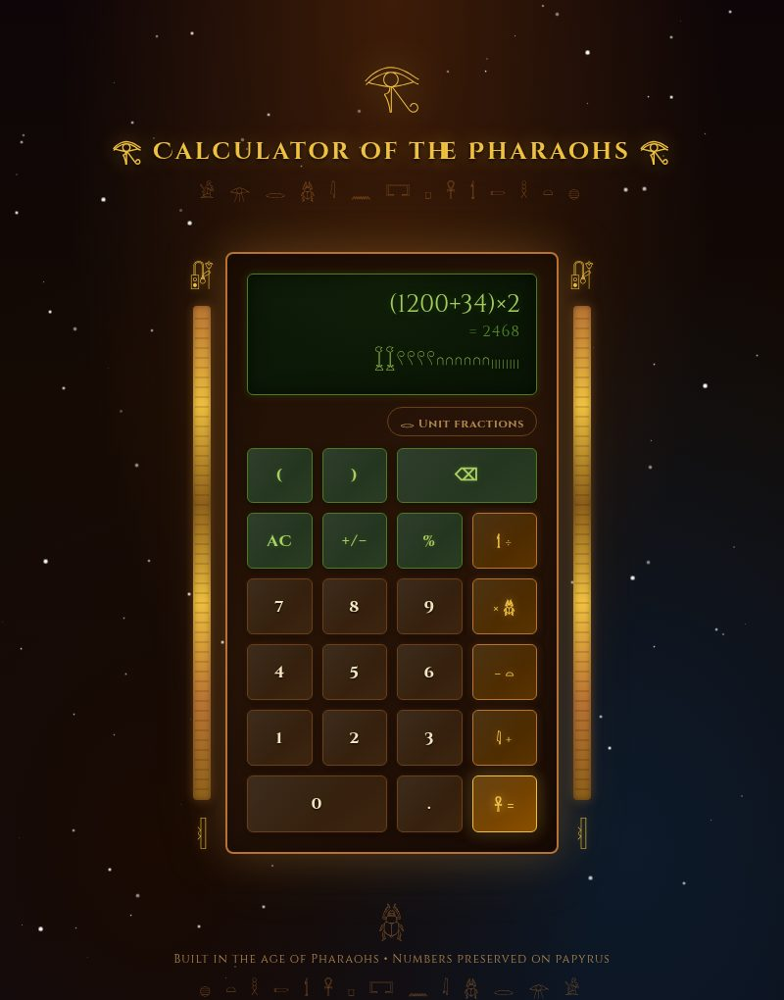

<div align="center">

```
𓂀 ─────────────────────────────────────────── 𓂀
   ██████╗ ██╗   ██╗██████╗ ████████╗██╗ █████╗ ███╗   ██╗
  ██╔════╝ ╚██╗ ██╔╝██╔══██╗╚══██╔══╝██║██╔══██╗████╗  ██║
  ██║  ███╗ ╚████╔╝ ██████╔╝   ██║   ██║███████║██╔██╗ ██║
  ██║   ██║  ╚██╔╝  ██╔═══╝    ██║   ██║██╔══██║██║╚██╗██║
  ╚██████╔╝   ██║   ██║        ██║   ██║██║  ██║██║ ╚████║
   ╚═════╝    ╚═╝   ╚═╝        ╚═╝   ╚═╝╚═╝  ╚═╝╚═╝  ╚═══╝
     C A L C U L A T O R   O F   T H E   P H A R A O H S
𓆣 ─────────────────────────────────────────── 𓆣
```

[](https://highviewone.github.io/EgyptianCalculator/)
[](LICENSE)
[](https://developer.mozilla.org/en-US/docs/Web/HTML)
[](https://developer.mozilla.org/en-US/docs/Web/CSS)
[](https://developer.mozilla.org/en-US/docs/Web/JavaScript)

*A fully functional calculator draped in the gold and mystery of ancient Egypt.*

<br />



</div>

---

## 𓇋 Features

| Feature | Description |
|---|---|
| 𓂀 **Egyptian Aesthetic** | Dark starfield sky, gold/bronze palette, temple pillars, Eye of Ra |
| 𓏏 **Hieroglyphic Numerals** | Results displayed in authentic ancient Egyptian number glyphs |
| 𓆣 **Full Calculator** | Addition, subtraction, multiplication, division, brackets, %, sign toggle, decimals, backspace |
| 𓆼 **Read the Glyphs** | Hover or tap any hieroglyph to see what it's worth (𓆼 lotus flower · 1,000) |
| 𓂋 **Unit Fractions** | Optional Egyptian-style fractions: 2/7 = 1/4 + 1/28, with the special 2/3 sign 𓂌 |
| 𓋹 **Live Preview** | Answer appears as you type — no need to hit equals first |
| 𓌀 **Keyboard Support** | Every button has a key, plus `F` for unit fractions — see Keyboard Shortcuts below |
| 𓀀 **Accessible** | Spoken button names and readings, visible focus, honours reduced-motion settings |
| 𓇋 **No Dependencies** | Pure HTML · CSS · JS — zero build steps, zero frameworks |
| 𓉐 **Responsive** | Works on desktop and phones, down to 320px wide |
| 𓊹 **Tested** | Unit tests plus browser tests in Chrome, Firefox, Safari's engine and phone screens on every pull request |

---

## 𓆼 Live Demo

**[highviewone.github.io/EgyptianCalculator](https://highviewone.github.io/EgyptianCalculator/)** — published by GitHub Pages from `main`, so every merge goes live within a couple of minutes.

---

## 𓎛 Egyptian Numeral System

Numbers are converted to ancient Egyptian hieroglyphics in real time. Hover over or tap any glyph in the answer to see its name and value; with the keyboard, Tab to the glyph line to hear or see the whole reading.

| Symbol | Value | Hieroglyph |
|--------|-------|-----------|
| Astonished Man | 1,000,000 | 𓁨 |
| Tadpole | 100,000 | 𓆐 |
| Pointing Finger | 10,000 | 𓂭 |
| Lotus Flower | 1,000 | 𓆼 |
| Coiled Rope | 100 | 𓍢 |
| Hobble | 10 | 𓎆 |
| Stroke | 1 | 𓏺 |

Turn on **Unit fractions** to see the fractional part of an answer the way scribes wrote it, as a sum of distinct unit fractions (2/7 = 1/4 + 1/28). Each 1/n is the mouth sign 𓂋 followed by the numeral for n. The one exception is 2/3, which had its own sign 𓂌 and comes first whenever a fraction reaches it, as in the Rhind Papyrus (3/4 = 2/3 + 1/12). If an answer has no simple fraction (like π), or the split would need more than five terms, it is rounded as usual.

> Numbers up to **9,999,999** are supported in hieroglyphic form. The Egyptian system had no zero, negatives or decimals, so a short note under the glyphs flags when a result is negative, rounded, zero or too large.

---

## 𓊪 Getting Started

No installation needed — just open the file.

```bash
git clone https://github.com/HighviewOne/EgyptianCalculator.git
cd EgyptianCalculator
open index.html   # macOS
# or: xdg-open index.html  (Linux)
# or: start index.html     (Windows)
```

**File structure:**
```
EgyptianCalculator/
├── index.html            # Structure, layout & link-preview tags
├── style.css             # Egyptian theming & animations
├── calc-core.js          # Pure logic: numerals, fractions, glyph readings, evaluation, input editing
├── calculator.js         # Display, buttons, keyboard & glyph explanations
├── favicon.svg           # Gold ankh tab icon
├── og-image.jpg          # Link-preview image (1200×630)
├── screenshot.jpg        # README screenshot
├── tests/                # Unit tests (*.test.js) and browser tests (*.spec.js)
├── package.json          # Test scripts; Playwright is the only (development) dependency
├── playwright.config.js  # Browser-test setup: local server and the five browser/screen setups
└── .github/workflows/    # Runs both test suites on every pull request
```

**Running the tests** (needs [Node.js](https://nodejs.org/) 18+):
```bash
node --test               # unit tests, nothing to install
npm install               # once, for the browser tests
npx playwright install chromium firefox webkit
npm run test:browser      # drives the real page in Chrome, Firefox and Safari's engine
```
Both run automatically on every pull request. The browser tests serve the page with `python3 -m http.server` and run in desktop Chrome, Firefox and WebKit (Safari's engine), plus iPhone- and Android-sized touch screens. To try one browser locally: `npx playwright test --project firefox`.

---

## 𓏏 Keyboard Shortcuts

| Key | Action |
|-----|--------|
| `0–9` | Enter digits |
| `+ - * /` | Operators |
| `.` | Decimal point |
| `Enter` or `=` | Calculate |
| `(` `)` | Brackets |
| `Backspace` | Delete last character |
| `Escape`, `Delete` or `C` | Clear all |
| `%` | Percent |
| `F` | Toggle unit fractions |

Brackets work like a phone calculator's: an unclosed bracket is closed for you in the preview and on `=` (`(2+3` → 5), and a number or bracket straight after another means multiply (`2(3+4)` → `2×(3+4)`).

`%` works like a phone calculator: after `+` or `−` it takes that percent of what comes before (`50 + 10 %` → `50 + 5` = 55); otherwise it divides the last number by 100 (`50 × 10 %` → `50 × 0.1` = 5). Inside brackets, the percent is of what comes before it in the same bracket.

---

## 𓋹 Contributing

Contributions are welcome! Please read the [contributing guidelines](.github/CONTRIBUTING.md) and open an issue or pull request.

---

## 𓀀 License

MIT — free to use, modify, and distribute. See [LICENSE](LICENSE).

---

<div align="center">

𓀀 𓁿 𓂋 𓆣 𓇋 𓈖 𓉐 𓊪 𓋹 𓌀 𓍿 𓎛 𓏏 𓐍

*Built in the age of Pharaohs · Numbers preserved on papyrus*

</div>
